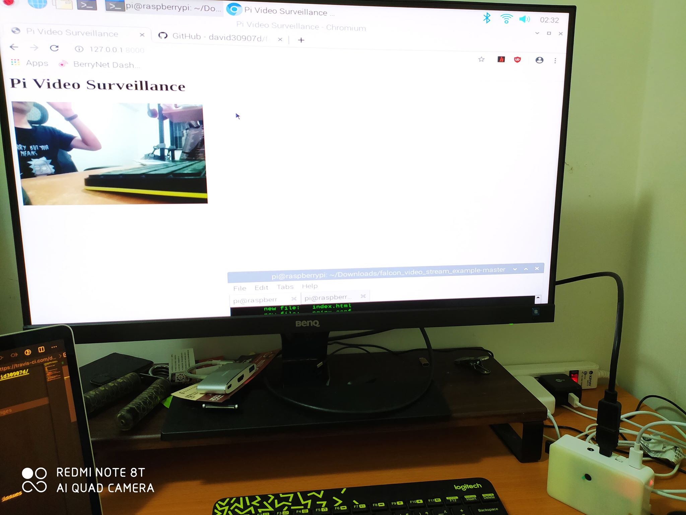

# Falcon Video Stream Example on Raspberry Pi 

## Demo

## Install

1. Python dependencies:
    1. `virtualenv venv; . venv/bin/activate`
    2. `pip install poetry`
    3. `poetry install`
2. Npm dependencies, for linter, formatter and commit linter (optional):
    1. `brew install npm`
    2. `npm ci`

## Run

`gunicorn --threads=2 -b 127.0.0.1:8000 project.app`